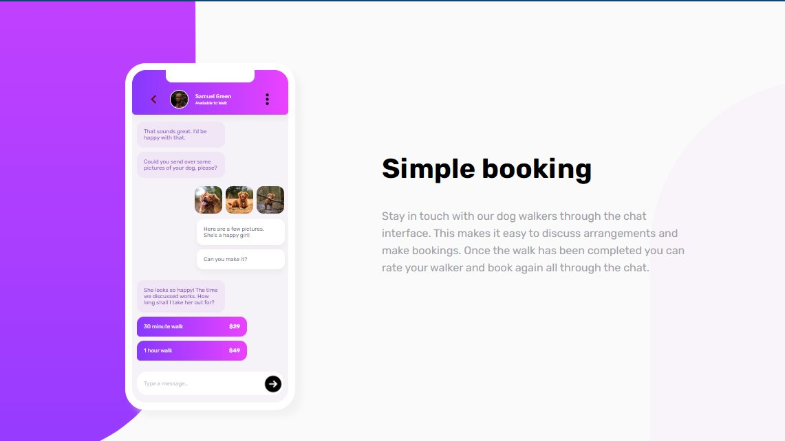

# Frontend Mentor - Chat app CSS illustration solution

This is a solution to the [Chat app CSS illustration challenge on Frontend Mentor](https://www.frontendmentor.io/challenges/chat-app-css-illustration-O5auMkFqY). Frontend Mentor challenges help you improve your coding skills by building realistic projects.

## Table of contents

- [Overview](#overview)
  - [The challenge](#the-challenge)
  - [Screenshot](#screenshot)
  - [Links](#links)
- [My process](#my-process)
  - [Built with](#built-with)
- [Author](#author)
- [Acknowledgments](#acknowledgments)

## Overview

Build the illustration of the chat app using CSS

### The challenge

Users should be able to:

- View the optimal layout for the component depending on their device's screen size

### Screenshot

### Links

- Solution URL: [My frontendmentor.io solution](https://your-solution-url.com)
- Live Site URL: [Chat App Illustration - GitHub Pages](https://arbase.github.io/chat-app/)

## My process

### Built with

- Semantic HTML5 markup
- CSS custom properties
- Flexbox
- Mobile-first workflow

## Author

- Website - [Arbase](https://www.arbase.github.io)
- Frontend Mentor - [@arbase](https://www.frontendmentor.io/profile/arbase)
- Twitter - [@arbase\_](https://www.twitter.com/arbase_)

## Acknowledgments

Thanks to Front-end mentor for providing this challenge.
